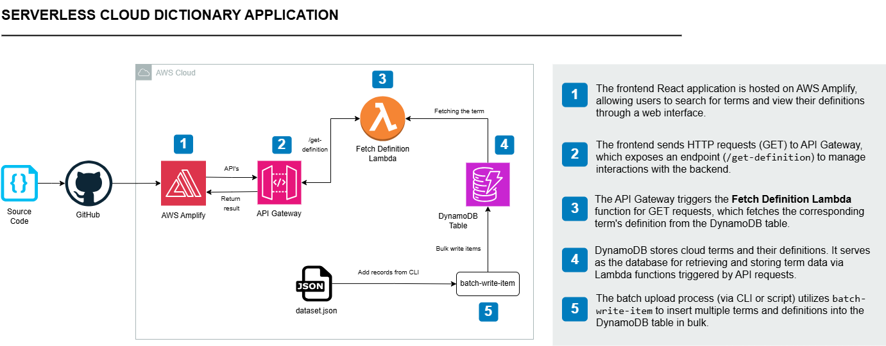

# 📘 Serverless Cloud Dictionary Application

---

## 📌 Overview

This project demonstrates a **serverless application on AWS** that allows users to search and store definitions of cloud-related terms.  
It eliminates the need for traditional server hosting by leveraging AWS’s fully managed services, making the solution **scalable, cost-effective, and highly available**.

The application provides a simple **React-based frontend** hosted on **AWS Amplify**, which communicates with a **serverless backend** powered by **API Gateway, Lambda, and DynamoDB**.

---

## 📑 Table of Contents

- [Overview](#-overview)  
- [Key Features](#-key-features)  
- [AWS Services Used](#-aws-services-used)  
- [Project Workflow](#-project-workflow)  
- [Architecture Diagram](#-architecture-diagram)  
- [Project Explanation and Screenshots](#-project-explanation-and-screenshots)  
- [Learning Outcome](#-learning-outcome)  
- [Credits](#-credits)  
- [License](#-license)

---

## ✅ Key Features

- **Fully serverless** architecture using AWS managed services  
- **React-based frontend** hosted on AWS Amplify  
- **Dictionary search and add functionality** for cloud-related terms  
- **Scalable NoSQL storage** in Amazon DynamoDB  
- **Secure API management** with Amazon API Gateway  
- **IAM-based security** to control access between services  

---

## 🛠️ AWS Services Used

| Service               | Role                                                                 |
|-----------------------|----------------------------------------------------------------------|
| **AWS Amplify**       | Hosts the React frontend application                                |
| **Amazon API Gateway**| Manages RESTful API endpoints between frontend and backend services  |
| **AWS Lambda**        | Handles API requests for fetching and adding dictionary terms       |
| **Amazon DynamoDB**   | Stores dictionary terms and their definitions in a NoSQL database   |
| **IAM Roles & Policies** | Ensures secure, least-privilege access across all AWS services |

---

## 🔁 Project Workflow

1. **User Interaction via Frontend**  
   - User searches or adds terms through the React application hosted on Amplify.  
2. **API Gateway Request**  
   - API Gateway exposes secure REST endpoints and forwards the request to Lambda.  
3. **Lambda Function Execution**  
   - Lambda retrieves existing definitions or inserts new terms into DynamoDB.  
4. **Database Storage in DynamoDB**  
   - All dictionary terms and their definitions are stored in DynamoDB.  
5. **Response to Frontend**  
   - The processed result is returned to the frontend for display.  

---

## 🧩 Architecture Diagram

---

## 📸 Project Explanation and Screenshots

You can find detailed explanations with screenshots in the following documents:

- [Setup Frontend and Host It on AWS Amplify](screenshots/setup-frontend-and-host-it-on-aws-amplify.docx)  
- [DynamoDB Setup](screenshots/configuration-of-dynamoDB-to-store-cloud-definitions.docx)  
- [Lambda Function Development](screenshots/creation-of-lambda-function-for-fetching-terms.docx)  
- [API Gateway Configuration](screenshots/api-gateway-integration-for-serverless-cloud-dictionary.docx)
---

## 🧠 Learning Outcome

This project helped reinforce concepts such as:  
- Hosting modern web applications on **AWS Amplify**  
- Building serverless APIs with **API Gateway and Lambda**  
- Using **DynamoDB** for scalable NoSQL storage  
- Designing secure cloud applications with **IAM roles and policies**  
- Deploying and integrating multiple AWS services into a seamless solution  

---

## 👩‍💻 Credits

Project implemented from the course:
**"5 Intermediate AWS Projects" by Tech With Lucy**  

Implemented by: **Saba Ijaz**

---

## 📜 License

This project is intended for educational and portfolio purposes.  
The project idea belongs to **Tech With Lucy**.
